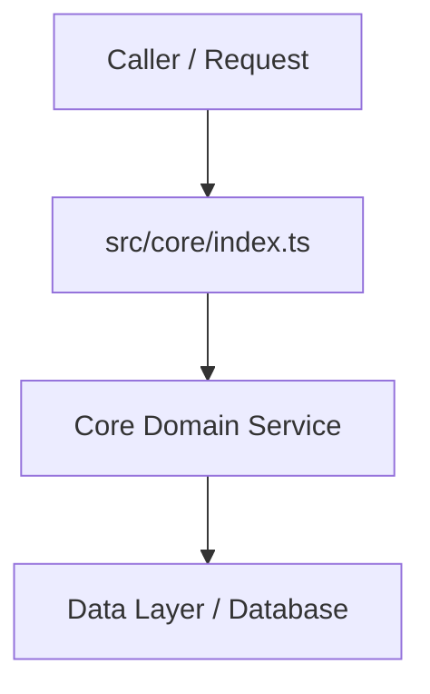

# Phase 1 Cognitive Comprehension & Operator Verification Dossier
**Domain**: `core` | **Author**: `Computer 1 (Alpha)` | **Auditor**: `Computer 2 (Beta)`

---

## 1. Executive Summary & 1-Sentence Feynman Compression (Technique 6)
> **1-Sentence Mental Model**:
> *"Write a concise 1-sentence plain language summary describing what this component achieves."*

---

## 2. Component & Symbol Inventory
- `src/core/...`: Core business logic and controllers.
- `tests/core/...`: Unit and contract test specifications.

---

## 3. Entry Point & Call Graph Map (Technique 1)


---

## 4. Contract-First Test Specifications (Technique 2)
- Unit tests verifying deterministic inputs and outputs in `tests/`.
- Run command: `npm test`

---

## 5. Domain Data Lifecycle & Entity Journeys (Technique 3)
```
[Input Payload] ──▶ [Validation] ──▶ [Transformation] ──▶ [Storage/Egress]
```

---

## 6. Cognitive Gate Mask: Skipped vs. Core Logic (Technique 4)
- **Core Business Logic (Must Read First)**: Core mathematical / domain logic in `src/`.
- **Non-Blocking Noise (Skip on Pass 1)**: Telemetry, debug loggers, metric counters.

---

## 7. Adversarial Failure Path & Security Audit (Technique 5)
- **Timing Attack Resistance**: Critical string/token checks use `crypto.timingSafeEqual`.
- **Account Enumeration Defense**: Uniform error handling for authentication failures.
- **Input Sanitization**: Strict parameter parsing with zero unvalidated assumptions.

---

## 8. Operator Sign-Off & Verification Rubric
- [ ] TypeScript compiles cleanly (`strict: true`)
- [ ] Unit tests pass 100% with exit code 0
- [ ] Zero ghost packages detected (`npm run check:hallucinations`)
- [ ] Styx DAST red-team tests pass (`npm run pentest`)
