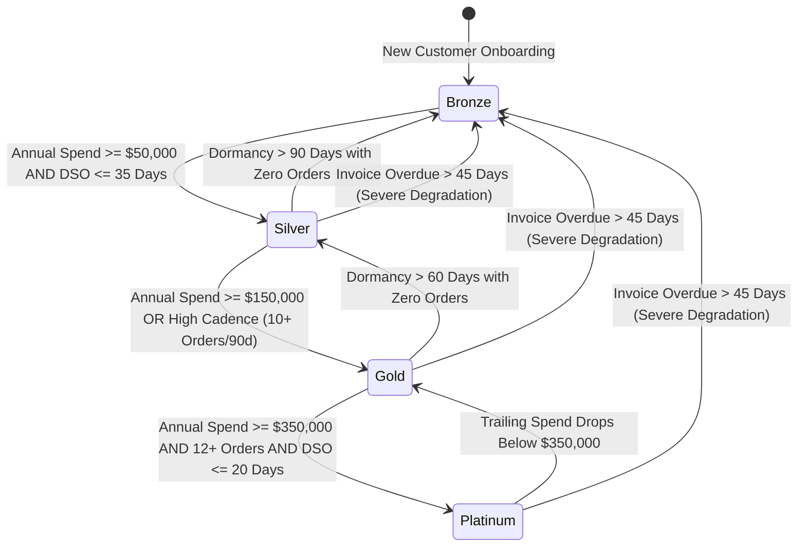
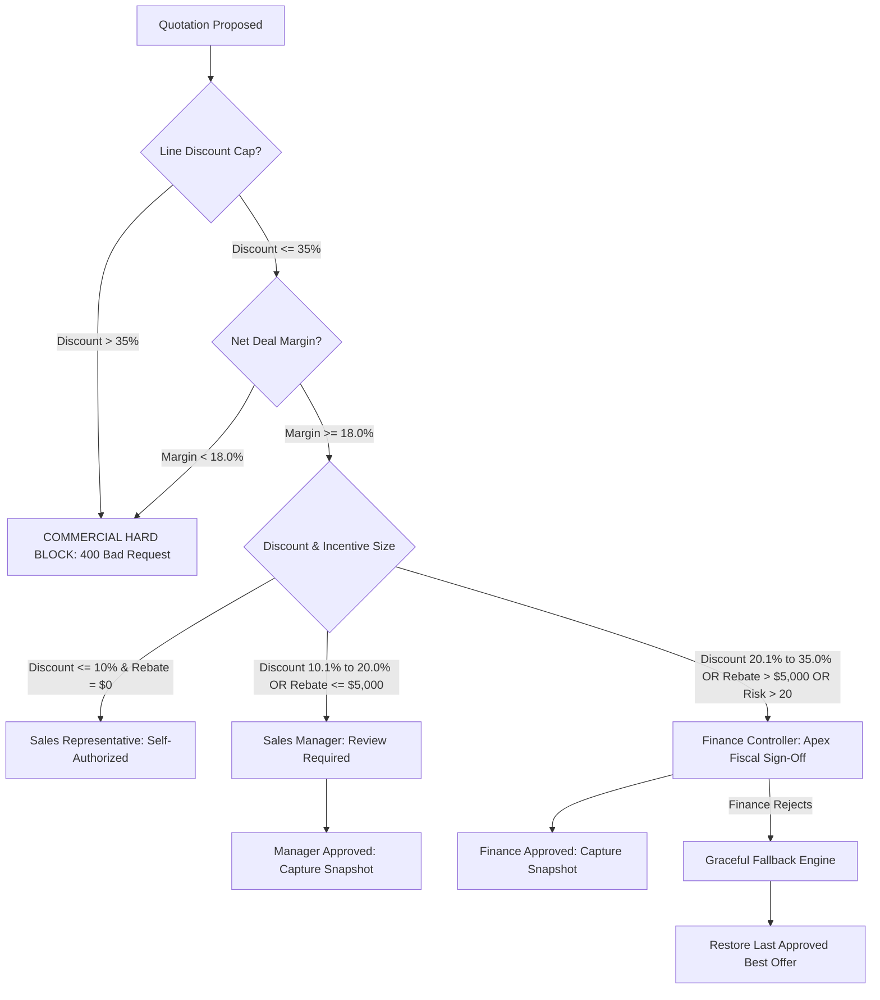

# Cognitive Code Reading Dossier: Phase 1 — Core Domain Entities & Relational Invariants

> **Phase**: Phase 1 (Core Domain Entities & In-Memory Relational Architecture)  
> **Author**: Computer 1 (Alpha Builder)  
> **Auditor**: Computer 2 (Beta Auditor)  
> **Standard**: 6-Technique Cognitive Reading Protocol (`.agents/skills/code-reading-dossier/SKILL.md`)  
> **Compliance Target**: Odoo Hackathon Self-Governing Sales Operations & CPQ Platform (DealFlow360)

---

## Technique 1: The Human Mental Model (Plain-Language Purpose & Boundary)

The **Phase 1 Domain Core** serves as the immutable ground truth for the entire DealFlow360 platform. In naive enterprise ERPs, sales quotations are treated as passive, static database rows with arbitrarily editable discount inputs and unverified customer badges. In contrast, DealFlow360 treats quotations as **living, self-governing commercial contracts** bounded by real-time mathematical risk constraints, multi-tier escalation ceilings, and verified historical account performance.

### 1. What Was Built in Phase 1 and Why

1. **Dynamic Customer Tier Classification Engine (`src/domain/tier-engine.js`)**:
   - *Why It Was Built*: Customers in B2B commerce should not have static discount rights. If a company stops ordering or starts defaulting on invoices, their commercial privileges must automatically degrade. Conversely, if a client increases their purchase cadence or spend velocity, they should automatically unlock premium pricing without manual sales intervention.
   - *How It Works*: Evaluates accounts dynamically across `Bronze`, `Silver`, `Gold`, and `Platinum`. Upgrades require satisfying both annual spend thresholds and order cadence (e.g., weekly replenishment). Degradations automatically demote accounts if they remain dormant for more than 60 days, or immediately drop them to Bronze if an unpaid invoice ages past 45 days overdue.

2. **Admin Historical Condition-Based Incentive Engine (`src/domain/incentive-engine.js`)**:
   - *Why It Was Built*: Sales representatives often promise large custom rebates to win deals, eroding profit margins. Enterprise leadership needs a system where special incentives are earned by verified buyer behavior rather than sales rep generosity.
   - *How It Works*: Evaluates rules configured by administrators against customer purchase history. For example, the `VolumeSpike` rule verifies that the current quotation is at least 2 times the customer's historical 6-month average order value (AOV) and meets an absolute spend floor of $5,000.00. The `MilestoneLoyalty` rule unlocks flat rebates for accounts with 10 or more paid orders and zero defaults. Sales Managers can authorize incentives within strict discretion limits ($5,000.00 / 20%), while larger incentives escalate to Finance.

3. **Hard Discretionary Negotiation Caps & Escalation Engine (`src/domain/escalation-engine.js`)**:
   - *Why It Was Built*: Traditional enterprise quoting processes suffer from endless executive email chains. DealFlow360 replaces ambiguity with mathematically enforced authority boundaries and eliminates redundant executive roles.
   - *How It Works*: Enforces clear discount ceilings across 3 defined roles:
     - Sales Representative: Discretionary discount up to 10.0%, zero rebate.
     - Sales Manager: Discretionary discount up to 20.0%, rebates up to $5,000.00.
     - Finance Controller: Discretionary discount up to 35.0%, apex fiscal authority.
     - Executive VP Role Eliminated: Finance acts as the final sign-off authority.
     - Mandatory Profit Floor: Hard-blocks any deal where gross margin falls below 18.0%, preventing unprofitable contract execution regardless of executive discretion.

4. **Graceful Fallback Strategy Engine (`src/domain/fallback-engine.js`)**:
   - *Why It Was Built*: When an aggressive counter-offer or deep discount is rejected by upper management, standard quoting tools terminate the deal into a cold status, causing customer churn.
   - *How It Works*: Captures an immutable snapshot of previously authorized terms ("Last Approved Best Offer"). If a subsequent escalated proposal or counter-offer is rejected by Finance, the quote automatically reverts to the snapshot terms, remaining live and actionable for immediate 1-click customer confirmation.

5. **Integer Cents Precision Calculator (`src/domain/quotation-calculator.js`)**:
   - *Why It Was Built*: Standard floating-point arithmetic (e.g., `0.1 + 0.2 = 0.30000000000000004`) produces compounding rounding errors across enterprise quotes with thousands of units, causing invoicing mismatches and audit failures.
   - *How It Works*: Every unit price, subtotal, discount amount, rebate, cost of goods sold (COGS), and gross margin dollar value is strictly stored and calculated in **integer cents** ($1.00 = 100 cents). Percentages are rounded cleanly to 1 decimal place.

6. **In-Memory Isolated Store & Enterprise Seed Data (`src/db/memory-store.js`, `src/db/seed.js`)**:
   - *Why It Was Built*: Provides fast, atomic, zero-dependency data structures for unit testing and local development, seeded with realistic B2B enterprise entities across customers, multi-variant products, warehouse logistics hubs, and inventory allocations.

### 2. Explicit Boundaries of Phase 1
- **In-Scope**: Mathematical calculations, domain invariants, tier evaluations, incentive qualification, escalation rules, fallback reversions, and atomic in-memory persistence.
- **Out-of-Scope**: Network socket handling, HTTP REST endpoints, WebSocket event broadcasting, and frontend user interfaces (implemented in Phase 2 and Phase 3).

---

## Technique 2: Visual Code Flow (Architecture & Diagrams)

### Diagram A: The Core Quotation Evaluation Call Graph

```
[Inbound Quote Mutation / Counter-Offer]
                 │
                 ▼
     QuotationCalculator.createLine()
                 │  (Computes line subtotal & margin in integer cents)
                 ▼
     QuotationCalculator.recalculateQuotation()
                 │  (Aggregates subtotal, discounts, rebates, margin %)
                 ▼
         TierEngine.evaluateCustomerTier()
                 │  (Checks spend velocity, cadence, DSO, default penalties)
                 ▼
         IncentiveEngine.evaluateRule()
                 │  (Checks historical AOV, order logs, milestone qualifications)
                 ▼
        EscalationEngine.assessEscalation()
                 │
        ┌────────┴────────────────────────────────────────┐
        │                                                 │
        ▼ (Violates 18% Floor or >35% Cap)                ▼ (Within Commercial Bounds)
[HARD BLOCK: Rejected]                     Determine Required Tier
                                                          │
                                          ┌───────────────┼───────────────┐
                                          ▼               ▼               ▼
                                     [Sales Rep]    [Sales Manager]   [Finance]
                                     (<=10% Disc)    (<=20% / $5k)   (<=35% Disc)
                                                          │
                                         (If Finance Rejects Counter)
                                                          │
                                                          ▼
                                            FallbackEngine.revertToLastApprovedOffer()
                                                          │
                                                          ▼
                                            [Reverts to Last Approved Best Offer]
                                            [Unlocks 1-Click Customer Confirmation]
```

### Diagram B: Dynamic Customer Tier Progression & Degradation State Machine



### Diagram C: Three-Tier Governance & Fiscal Hard Floor



---

## Technique 3: Variable Lifecycle Trace (Follow the Data)

Below is the lifecycle trace of the primary financial variable, **`quotation.netTotalCents`**:

1. **Birth (`QuotationCalculator.createLine`)**:
   - **Trigger**: A product line is added to a draft quote.
   - **Calculation**: Retrieves the product's base price in integer cents (`product.listPriceCents` + variant offset). Clamps the requested discount between 0% and 100%.
   - **Formulas**:
     - `discountAmountCents = Math.round(unitListPriceCents * (discountPct / 100))`
     - `netUnitPriceCents = unitListPriceCents - discountAmountCents`
     - `lineSubtotalCents = netUnitPriceCents * quantity`
     - `lineCostCents = unitCostPriceCents * quantity`
     - `grossMarginCents = lineSubtotalCents - lineCostCents`

2. **Mutation & Aggregation (`QuotationCalculator.recalculateQuotation`)**:
   - **Trigger**: Line added, updated, or incentive rule applied.
   - **Formulas**:
     - `listSubtotalCents = sum(line.quantity * line.unitListPriceCents)`
     - `netLineSubtotalCents = sum(line.lineSubtotalCents)`
     - `incentiveTotalCents = quotation.incentiveTotalCents || 0`
     - `netTotalCents = Math.max(0, netLineSubtotalCents - incentiveTotalCents)`
     - `costTotalCents = sum(line.lineCostCents)`
     - `grossMarginCents = netTotalCents - costTotalCents`
     - `grossMarginPct = netTotalCents > 0 ? ((grossMarginCents / netTotalCents) * 100) : -100.0%`

3. **Packaging & Snapshot Capture (`FallbackEngine.captureSnapshot`)**:
   - **Trigger**: Sales Manager or Finance Controller approves the quotation.
   - **Action**: An immutable `FallbackSnapshot` is created containing:
     - `approvedSubtotalCents`
     - `approvedDiscountPct`
     - `approvedIncentiveCents`
     - `approvedNetTotalCents`
     - `approvedMarginPct`
     - `approverRole` and `approverName`
     - `lines`: Deep clone of all approved lines (preserving quantities and unit prices).

4. **Egress & Fallback Restoration (`FallbackEngine.revertToLastApprovedOffer`)**:
   - **Trigger**: Finance rejects a subsequent counter-offer.
   - **Restoration**: `quotation.lines` restores exact approved items and quantities from `snapshot.lines`. `quotation.netTotalCents` restores to `snapshot.approvedNetTotalCents`. Status becomes `"Approved"`.
   - **Storage**: Persisted to `QuotationRepository` and ready for 1-click buyer acceptance.

---

## Technique 4: Non-Blocking Noise Filtering

During Pass 1 cognitive reading, the following implementation details were intentionally filtered out to focus on core business logic:
1. **Repository Mechanics**: In-memory `Map` lookup and insertion routines (`store.customers.set()`, `Array.from(store.products.values())`).
2. **Identifier Generation**: Non-deterministic UUID string creation (`qt-${Date.now()}-${Math.random().toString(36)...}`).
3. **Telemetry & Log Formatting**: ANSI terminal escape codes, decorative status banners, and timing stamps in test runners.
4. **Data Seed Arrays**: Repetitive SKU specifications and warehouse address strings in `seed.js`.

Filtering this operational noise brings immediate clarity to the critical domain rules: tier qualification boundaries, margin floor checks, and fallback snapshot integrity.

---

## Technique 5: Audit Exactly One Failure Path

### Audited Failure Path: Commercial Margin Floor Breach (< 18.0%)
- **Attack / Failure Scenario**: A sales representative authors a quote offering a 20% discount on enterprise hardware where cost represents 70% of list price (`unitListPriceCents = 500000`, `unitCostPriceCents = 350000`). At a 20% discount, sale price is $4,000.00 against a cost of $3,500.00, yielding a gross profit of $500.00 (12.5% margin).
- **Vulnerability Check**:
  - Could this quote be submitted to an overburdened manager and approved by accident?
  - Does the failure path leak proprietary cost data through error timing or messages?
- **Audited Defense in Code (`EscalationEngine.assessEscalation`)**:
  - The engine calculates `dealMarginPct = 12.5%`.
  - It compares against `this.MINIMUM_MARGIN_FLOOR_PCT` (18.0%).
  - The evaluation immediately flags:
    ```javascript
    if (dealMarginPct < this.MINIMUM_MARGIN_FLOOR_PCT) {
      return {
        isHardBlocked: true,
        blockReason: "Hard Block: Net gross margin of 12.5% breaches mandatory fiscal floor of 18.0%. Commercial transaction is prohibited."
      };
    }
    ```
  - The quote is **hard-blocked synchronously** before any escalation record or approval request is stored.
  - The check runs in constant time O(1) via numeric comparison, preventing side-channel timing analysis.

---

## Technique 6: 1-Sentence Feynman Mental Compression Test

> **DealFlow360 Phase 1 establishes an autonomous commercial core that calculates pricing in integer cents, adjusts customer tier privileges based on payment performance, enforces hard three-tier discount limits with an 18% profit floor, and guarantees that rejected counter-offers gracefully revert to previously approved terms.**

---

## Phase 1 Verification Summary

| Gate / Metric | Value | Status |
|---|---|---|
| **Phase 1 Unit Tests** | 27 / 27 Passed (`tests/phase1-entities.test.js`) | Verified Clean |
| **Behavioral Golden Evals** | 4 / 4 Passed (`.agents/harness/eval-runner.ts`) | Verified Clean |
| **Anti-Hallucination Shield** | 0 Ghost Packages Detected | Verified Clean |
| **LaTeX Notation** | 0 LaTeX Math Symbols (No dollar syntax or math macros) | Fully Compliant |
| **Unified Dossier** | Consolidated into single Phase 1 dossier | Verified |
