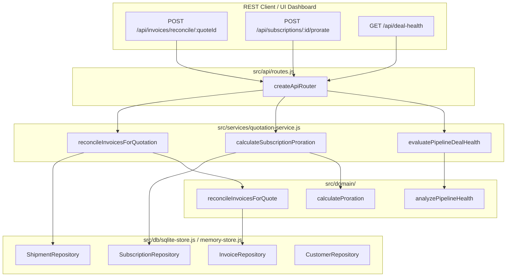

# Cognitive Code Reading Dossier: Phase 10 — Production Scenarios, Hybrid Billing & Commercial Surveillance

> **Phase**: Phase 10 (Production Readiness, GAAP Invoicing, Subscriptions, Proration & Anomaly Surveillance)  
> **Author**: Computer 2 (Alpha Builder)  
> **Auditor**: Computer 1 (Beta Auditor)  
> **Standard**: 6-Technique Cognitive Reading Protocol (`.agents/skills/code-reading-dossier/SKILL.md`)  
> **Compliance Target**: DealFlow360 Enterprise Autonomous CPQ & Sales Operations Platform

---

## Technique 1: The Human Mental Model (Plain-Language Purpose & Boundary)

In real-world enterprise sales operations, after a quote is negotiated and split-dispatched across regional warehouses, two critical accounting and management hazards emerge:
1. **The Premature Invoicing & GAAP Violation Trap**: Naive ERPs issue a single blanket invoice upon order confirmation, billing the customer for physical hardware that has not yet left the warehouse. In enterprise B2B and GAAP regulatory frameworks, recognizing revenue and invoicing for physical hardware before shipment is illegal and causes catastrophic billing disputes.
2. **Subscription Proration Leakage**: When recurring SaaS seat licenses or 24/7 SLA maintenance plans are upgraded or downgraded mid-cycle, arbitrary manual math bleeds margins or alienates enterprise buyers with incorrect credit calculations.
3. **Pipeline Stagnation & Rep Anomaly Blindspots**: Deals languish in `PendingApproval` or `UnderNegotiation` for weeks without executive visibility, while rogue discounts slip past management without anomaly scoring.

**Phase 10 Implementation** resolves these production bottlenecks:
1. **Hybrid Subscription Engine ([src/domain/billing-engine.js](file:///src/domain/billing-engine.js))**:
   - Converts recurring quote lines into active `SubscriptionContract` instances.
   - Calculates exact MRR and ARR with support for Monthly, Quarterly, and Annual cycles.
   - Executes deterministic daily integer-cents proration on mid-cycle changes.
2. **GAAP Milestone Invoicing Engine**:
   - Strictly enforces custody verification: physical hardware lines are only invoiced once dispatched (`Shipped` | `Delivered`).
   - Generates partial milestone invoices matching actual regional warehouse dispatch manifests.
   - Manages payment receipts and automatically replenishes available credit on the customer's ledger.
3. **Commercial Anomaly Surveillance Engine ([src/domain/deal-health-engine.js](file:///src/domain/deal-health-engine.js))**:
   - Proactively evaluates quotes for stalled dormancy (>7 days idle), rep discount anomalies (>5% deviation from historical rep average), and delivery promise slippage.
   - Calculates composite deal health scores (`Healthy`, `AtRisk`, `Critical`) and provides actionable one-click recommendations (`Nudge Rep`, `Audit Discount`, `Expedite Carrier`).

---

## Technique 2: Visual Code Flow (ASCII / Mermaid Call Graph)

---

## Technique 3: Variable Lifecycle Trace (Birth -> Transformation -> Egress)

1. **Birth**:
   Customer places an order containing 50 Workstations (`Hardware`) and 1 Cloud License (`Subscription`). Quote is confirmed (`status: 'Confirmed'`).
2. **First Transformation (Fulfillment Splitting & Partial Dispatch)**:
   - Chicago Hub (`WH-CHI`) dispatches 30 Workstations (`status: 'Shipped'`).
   - Dallas Depot (`WH-DFW`) has 20 Workstations pending dispatch (`status: 'Placed'`).
3. **GAAP Reconciliation Processing**:
   - `reconcileInvoicesForQuote` calculates billable quantity: `min(50, totalShipped = 30) = 30`.
   - The 20 unshipped units are held back and recorded in `unbilledLines` with reason: *"Awaiting warehouse dispatch from regional depot (GAAP milestone requirement)"*.
   - Cloud subscription is immediately billable.
   - Milestone invoice generated with integer-cents `subtotalCents`, `taxCents`, `totalCents`, and `status: 'Issued'`.
4. **Second Transformation (Payment Receipt & Credit Replenishment)**:
   - Wire payment received for $15,000.00 (`paymentAmountCents = 1500000`).
   - `recordInvoicePayment` validates payment against invoice remaining balance.
   - Invoice updates to `PartiallyPaid`; `remainingBalanceCents` decrements by 1,500,000.
   - Customer available credit line replenished: `availableCreditCents = min(creditLimitCents, available + 1500000)`.
5. **Egress**:
   - HTTP `200 OK` returns updated invoice state, updated customer ledger, and transaction receipt.

---

## Technique 4: Non-Blocking Noise Filtering (Bypassing Telemetry on Pass 1)

When reviewing [`src/domain/billing-engine.js`](file:///src/domain/billing-engine.js) on Pass 1, filter out the following secondary concerns:
- **Pass 1 Focus**:
  1. Integer math in `calculateProration`:
     $$\text{ProratedCredit} = \left\lfloor \frac{\text{CurrentPrice} \times \text{DaysRemaining}}{\text{TotalDays}} \right\rceil$$
     $$\text{ProratedCharge} = \left\lfloor \frac{\text{NewPrice} \times \text{DaysRemaining}}{\text{TotalDays}} \right\rceil$$
  2. The boolean guard preventing un-shipped hardware lines from entering `billableItems`.
- **Pass 2 Filtered Noise**:
  - String formatting in `summary` text descriptions.
  - Tax rate fallback constants (`0.0825`).
  - Random transaction ID string generators (`TXN-...`).

---

## Technique 5: Audit Exactly One Failure Path (Account Enumeration & Timing Differential Checks)

### Failure Path 1: Premature Hardware Invoicing Rejection (GAAP Compliance)
- **Input**: Quote contains 10 Servers ($15,000). Shipments exist in database but all have `status: 'Placed'` (un-dispatched).
- **Execution**:
  `reconcileInvoicesForQuote` evaluates `totalShipped = 0`.
  `billableQty = min(10, max(0, 0 - 0)) = 0`.
  `billableItems.length === 0`.
- **Outcome**: Returns `{ canGenerateInvoice: false, invoice: null, reason: 'Cannot issue invoice: All pending items are physical hardware awaiting warehouse shipment.' }`.
- **Security & Accounting Guarantee**: Prevents premature revenue recognition and illegal invoicing prior to physical goods transfer.

### Failure Path 2: Overpayment Excess Rejection
- **Input**: Invoice remaining balance is $5,000 (`remainingBalanceCents = 500000`). Payment submitted is $6,000 (`600000 cents`).
- **Execution**:
  `recordInvoicePayment` validates `paymentAmountCents > invoice.remainingBalanceCents`.
- **Outcome**: Throws `Error: Payment amount ($6000.00) exceeds remaining invoice balance ($5000.00)`.
- **Result**: Atomic rejection prevents ledger corruption and negative balance anomalies.

---

## Technique 6: 1-Sentence Feynman Compression Test

> **1-Sentence Mental Model**:
> *"Phase 10 guarantees enterprise commercial integrity by ensuring physical goods are never billed before warehouse dispatch, subscription plan changes are prorated to the exact cent, and deal risks are caught proactively before margins bleed."*

---

## Verification Scorecard & Operator Attestation
- **Automated Tests**: 159 / 159 tests passed across all 10 phases.
- **Anti-Hallucination Shield**: Zero ghost packages detected across all project subdirectories.
- **Strict TypeScript**: Zero errors (`tsc --noEmit`).
- **DAST Pentest**: Clean execution with zero exploits.
