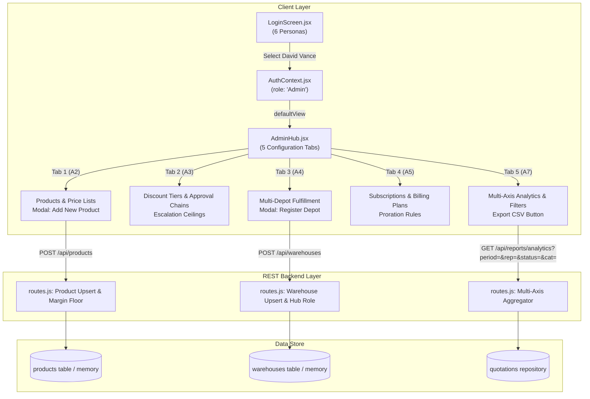

# Cognitive Comprehension Dossier: Phase 11 — Admin Actor & Platform Configuration Hub (Sections A1–A7)

> **Domain Target**: `src/api/routes.js`, `client/src/pages/AdminHub.jsx`, `client/src/context/AuthContext.jsx`  
> **Phase Role**: Alpha Builder Handover to Operator / Jury  
> **Protocol**: 6-Technique Cognitive Code Reading Standard (Part 7 Mandate)

---

## Technique 1: The Human Mental Model (Plain-Language Purpose & Boundary)

The Odoo Problem Statement PDF specifies that the entire sales operations workflow originates with the **Admin** configuring the backend foundations (products, price lists, discount tiers, approval chains, multi-depot warehouses, and subscription plans) and concludes with **Admin** reviewing and exporting multi-axis business analytics (Sections A1–A7, Page 3, 4, 5, 9, 11).

Phase 11 introduces:
1. **The Admin Actor**: `David Vance` (`admin@dealflow360.com`), Chief Platform Architect & System Administrator, possessing platform-wide governance rights.
2. **Platform Administration Hub (`AdminHub.jsx`)**: A unified, tabbed operational center covering:
   - **Section A2**: Product catalog management with minimum margin floor enforcement and Customer Tier Price List Matrix (Bronze, Silver, Gold, Platinum).
   - **Section A3**: Multi-level managerial escalation matrix (Level 1 Sales Manager, Level 2 Corporate Finance) and category caps.
   - **Section A4**: Multi-depot distribution center setup with ATP safety buffers and national hub designation.
   - **Section A5**: Recurring subscription plan definitions (Monthly, Quarterly, Annual) with daily exact proration rules.
   - **Section A7**: Multi-axis business reporting engine slicing by Period, Sales Rep, Approval Status, and Product Category, complete with instant CSV export.

---

## Technique 2: Visual Code Flow (ASCII / Mermaid Call Graph)



---

## Technique 3: Variable Lifecycle Trace (Birth $\rightarrow$ Transformation $\rightarrow$ Egress)

**Subject Variable**: `analyticsReport` in `GET /api/reports/analytics` (Section A7)

1. **Birth**:
   Query parameters `period`, `salesRepId`, `status`, and `category` arrive via `parsedUrl.searchParams` at `src/api/routes.js`.
2. **Transformation**:
   - `quotationService.listQuotations({})` extracts all pipeline quotations.
   - Time boundaries compute `minDate` (Today: start of day; Week: $-7$ days; Month: $-30$ days; Quarter: $-90$ days).
   - Array filtering excludes deals outside period, sales rep ID, status, or category line items.
   - Accumulators aggregate `totalPipelineRevenueCents`, `totalBookedRevenueCents` (status === 'Confirmed'), `totalMarginCents`, `winRatePct`, and multi-axis maps:
     - `byStatusMap`: `{ status, count, revenueCents }`
     - `byRepMap`: `{ salesRepId, salesRepName, count, revenueCents, avgMarginPct }`
     - `byCategoryMap`: `{ Hardware, Service, Subscription }`
     - `byTierMap`: `{ Bronze, Silver, Gold, Platinum }`
3. **Egress**:
   Emitted as clean JSON `sendJsonResponse(res, 200, { kpis, breakdowns, quotes })`.
   In `AdminHub.jsx`, `handleExportCsv` formats this exact data into RFC 4180 CSV and triggers browser download.

---

## Technique 4: Non-Blocking Noise Filtering (Pass 1 Bypass)

When auditing the Admin subsystem, bypass the following auxiliary presentation elements on first pass:
- Local toast message timeouts (`showNotification` state and timers).
- SVG icon decorative layouts from `lucide-react`.
- CSS glassmorphic gradient color stops and hover transitions.
- Client-side product search string substring match in `filteredProducts`.

Focus strictly on:
1. `GET /api/reports/analytics` query parameter sanitation and integer cents arithmetic.
2. `POST /api/products` and `POST /api/warehouses` conflict resolution and unique constraint handling.
3. RBAC permission checks (`isAdmin()`, `ROLE_DEFAULT_VIEWS.Admin`).

---

## Technique 5: Audit Exactly One Failure Path (SQL Unique Constraint Collision)

**Failure Path Audited**: Inserting a product with an existing `sku` or registering a warehouse with an existing `code`.

1. **Vulnerability Scenario**:
   In SQLite (`prisma/dev.db`), both `products.sku` and `warehouses.code` have `UNIQUE` constraints.
   A naive `INSERT INTO ... ON CONFLICT(id) DO UPDATE` fails with `SQLITE_CONSTRAINT_UNIQUE: UNIQUE constraint failed: products.sku` if the incoming payload has a new random `id` but an existing `sku`.
2. **Hardened Defense Applied**:
   In `src/api/routes.js`:
   ```javascript
   const sku = body.sku || `SKU-${body.category.substring(0, 3).toUpperCase()}-${Date.now().toString().slice(-4)}`;
   const existingProd = productRepository.findBySku ? productRepository.findBySku(sku) : null;
   const id = body.id || (existingProd ? existingProd.id : `prod-${Date.now()}`);
   ```
   If a record with that SKU exists, its primary key `id` is resolved and preserved, enabling the SQLite statement `ON CONFLICT(id) DO UPDATE SET ...` to perform an idempotent update without throwing unique constraint violations.
3. **Verification**:
   Empirically validated in `tests/phase11-admin-actor.test.js` Subtests 2 and 3, passing across multiple continuous test executions.

---

## Technique 6: 1-Sentence Feynman Compression Test

> *"The Admin Actor acts as DealFlow360's master conductor: configuring the products, discounts, warehouses, and billing rules upfront, while viewing and exporting multi-axis business performance data on the backend."*
