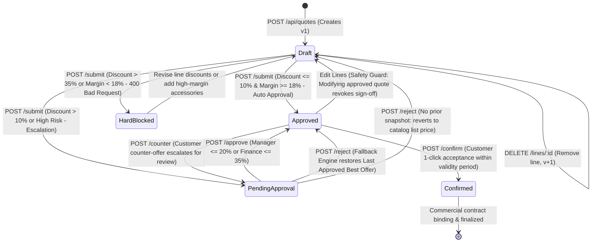
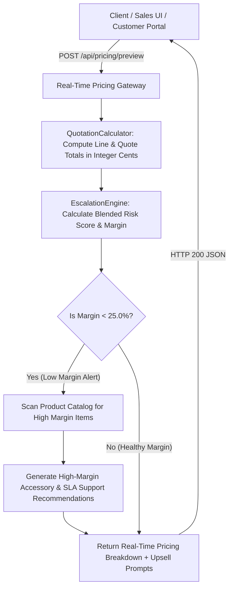

# Cognitive Code Reading Dossier: Phase 2 — REST API, Real-Time Pricing Gateway & Quotation Lifecycle State Machine

> **Phase**: Phase 2 (REST API & Real-Time Pricing Gateway)  
> **Author**: Computer 2 (Alpha Builder)  
> **Auditor**: Computer 1 (Beta Auditor)  
> **Standard**: 6-Technique Cognitive Reading Protocol (`.agents/skills/code-reading-dossier/SKILL.md`)  
> **Compliance Target**: Odoo Hackathon Self-Governing Sales Operations & CPQ Platform (DealFlow360)

---

## Technique 1: The Human Mental Model (Plain-Language Purpose & Boundary)

The **Phase 2 Implementation** bridges the core mathematical domain models authored in Phase 1 to the external digital world. In traditional sales quoting tools, pricing is evaluated only when a user clicks "Save", leading to severe negotiation friction, accidental margin loss, and multi-day approval bottlenecks. Furthermore, concurrent edits by sales reps and buyers frequently cause "lost update" bugs where one party's change silently overwrites another's.

Phase 2 solves these challenges by implementing three interconnected, production-ready modules in pure JavaScript with zero ghost packages:
1. **Zero-Dependency Native REST API Router (`src/api/routes.js`)**: Built entirely on Node.js native HTTP modules without third-party frameworks like Express. It provides clean, RESTful endpoints for customer accounts, product catalogs, active warehouses, inventory levels, quotation drafting, line adjustments, historical incentive applications, approval submissions, manager/finance approvals, rejection fallbacks, customer counter-offers, and 1-click binding confirmations. It enforces an uncompromising 1 Megabyte payload ceiling to immediately drop oversized requests and protect the service from Denial-of-Service (DoS) buffer exhaustion.
2. **Real-Time Pricing Gateway (`src/services/pricing-gateway.js`)**: Provides an instant, read-only pricing calculation engine that operates entirely in memory. It allows sales reps and customer portals to preview order totals, discounts, rebates, gross profit dollars, gross profit margin percentages, and blended risk scores in real time without writing uncommitted data to storage. When profit margins dip below 25.0%, it automatically inspects the product catalog and suggests high-margin accessories, hardware upgrades, and SLA support plans to actively lift deal profitability.
3. **Quotation Workflow & Lifecycle Service (`src/services/quotation-service.js`)**: A strict state machine managing the commercial quotation from birth to customer confirmation. It enforces **Optimistic Concurrency Control (OCC)** on every write operation using sequential integer version numbers and HTTP `If-Match` headers. If an operator or buyer attempts to update a quote using an outdated version, the platform rejects the mutation with HTTP `409 Conflict`, preventing silent data loss. It also enforces critical governance safeguards: any modification to an already-approved quote immediately revokes its approval and drops it back to `Draft`, and if a higher-tier approver rejects an aggressive counter-offer, the quote automatically reverts to the last approved snapshot rather than killing the deal.
4. **Real-World Formula Rectifications**: Every calculation is grounded in enterprise accounting practices:
   - **Gross Margin Percentage**: Handled in integer cents as `((revenue - cogs) / revenue) * 100` with strict division-by-zero protection. If revenue is $0 with positive cost, the platform returns `-100.0%` margin and triggers an immediate commercial hard block.
   - **Blended Risk Score Weighting**: Line items are weighted against the pre-discount list price subtotal (`lineListTotal / orderListTotal`), ensuring all line weights sum cleanly to 1.0 regardless of deep discounts.
   - **Dynamic DSO Credit Tolerance**: Evaluates customer payment timeliness relative to their agreed payment terms (`termsDays + 5`), preventing false credit downgrades for enterprise clients operating legitimately on Net 45 or Net 60 agreements.
   - **Volume Spike Minimum Spend Floor**: Prevents micro-order rebate abuse by requiring both a 2x historical average order value multiplier AND an absolute spend floor of $5,000.00.

The explicit boundary of Phase 2 is request handling, input sanitization, real-time pricing calculation, and quotation lifecycle orchestration. WebSocket pub/sub live collaboration and browser UI frontend screens are deferred to subsequent phases.

---

## Technique 2: Visual Code Flow (The Call Graph)

### Diagram A: The Request & Pricing Call Graph

```
[Inbound Client HTTP Request]
             │
             ▼
[parseJsonRequestBody()] ────> [Bytes > 1MB?] ────> YES ───> [HTTP 413: Destroy Socket]
             │
             ▼ NO
[JSON.parse() Safe Body]
             │
             ▼
    [createApiRouter()]
             │
   ┌─────────┴────────────────────────────────────────────────────────────────┐
   │                                                                          │
   ▼ (Read-Only / Preview)                                                    ▼ (State Mutation)
[POST /api/pricing/preview]                                       [POST /api/quotes/:id/lines]
   │                                                              [POST /api/quotes/:id/submit]
   ▼                                                              [POST /api/quotes/:id/approve]
PricingGateway.calculateQuotationPreview()                        [POST /api/quotes/:id/counter]
   │                                                                          │
   ├─► PricingGateway.calculateLinePricing()                                  ▼
   ├─► EscalationEngine.assessEscalation()                        QuotationService._assertConcurrencyVersion()
   │     (Calculates Blended Risk & Margin Floor)                             │
   ├─► PricingGateway.generateMarginRecommendations()                         ├─► Version Mismatch? ──> [HTTP 409 Conflict]
   │     (Identifies margin-lifting upsells)                                  │
   ▼                                                                          ▼ Version Validated
[HTTP 200: Live Breakdown Payload]                                QuotationCalculator.recalculateQuotation()
                                                                              │
                                                                              ▼
                                                                  EscalationEngine.assessEscalation()
                                                                              │
                                                                  ┌───────────┴───────────┐
                                                                  ▼ (Breaches 18% Floor)   ▼ (Within Bounds)
                                                              [Hard Block: 400]       Update State & Chain
                                                                                          │
                                                                                          ▼
                                                                              FallbackEngine.captureSnapshot()
                                                                                          │
                                                                                          ▼
                                                                              _incrementVersion() & Save DB
                                                                                          │
                                                                                          ▼
                                                                              [HTTP 200/201: Success Payload]
```

### Diagram B: Quotation Lifecycle & Concurrency State Machine



### Diagram C: Real-Time Pricing Gateway & Margin Recommendation Flow



---

## Technique 3: Variable Lifecycle Trace (Follow the Data)

Below is the lifecycle trace of the primary domain entity, the **`quotation`** object:

1. **Birth (`QuotationService.createDraftQuotation`)**:
   - **Origin**: Initialized when a sales representative initiates a new deal via `POST /api/quotes`.
   - **State**: Receives a unique ID (`qt-...`), a customer-facing quote number (`QT-2026-...`), customer metadata, sales rep attribution, 30-day expiration date, and initialized totals in integer cents.
   - **Invariants**: `status` is set to `"Draft"`, `version` is set to `1`, `lines` array is empty, and `approvalChain` is initialized.
   - **Storage**: Persisted to the in-memory repository and returned to the caller with HTTP `201 Created`.

2. **Mutation (`QuotationService.addLineItemToQuotation` / `updateLineItemDetails`)**:
   - **Trigger**: Inbound HTTP request containing product ID, quantity, discount percentage, and `expectedVersion`.
   - **Concurrency Check**: `_assertConcurrencyVersion` verifies that `expectedVersion === quotation.version`. If stale, execution halts immediately with `ConcurrencyConflictError` (HTTP 409).
   - **Calculation**: Passes product and line inputs to `QuotationCalculator.createLine`, which computes line list price, discount amount, net unit price, total cost, gross margin dollars, and margin percentage strictly in integer cents.
   - **Revocation Guard**: If the quotation was previously `"Approved"`, adding or editing lines automatically resets `status` to `"Draft"`, invalidating previous management sign-offs to prevent unauthorized deal modification.
   - **Version Bump**: `_incrementVersion` increments `version` by 1 and updates the ISO timestamp.

3. **Escalation Assessment (`QuotationService.submitQuotationForApproval`)**:
   - **Trigger**: Sales representative submits the quote for governance review via `POST /api/quotes/:id/submit`.
   - **Evaluation**: `EscalationEngine.assessEscalation` evaluates all line items and customer tier metrics:
     - If maximum discount is <= 10% and margin is >= 18%: Rep is self-authorized, `status` becomes `"Approved"`, and an initial baseline snapshot is captured.
     - If discount is > 10% and <= 20%: Escalates to `SalesManager`, setting `status` to `"PendingApproval"`.
     - If discount is > 20% and <= 35%: Escalates to `Finance`, setting `status` to `"PendingApproval"`.
     - If margin is < 18.0% or discount is > 35%: Commercial Hard Block triggered; request rejected with HTTP 400.
   - **Version Bump**: Increments `version` and saves audit entry to `approvalChain`.

4. **Sign-Off & Snapshot Capture (`QuotationService.approveQuotation`)**:
   - **Trigger**: Authorized manager or finance controller approves the quote via `POST /api/quotes/:id/approve`.
   - **Validation**: Verifies approver role matches or exceeds the required escalation tier.
   - **Snapshot**: `FallbackEngine.captureSnapshot` records an immutable copy of the approved lines, discount percentage, subtotal, and profit margin.
   - **State**: Transitions `status` to `"Approved"`. `version` is incremented.

5. **Rejection & Graceful Fallback (`QuotationService.rejectQuotationAndFallback`)**:
   - **Trigger**: Higher-tier reviewer rejects aggressive terms via `POST /api/quotes/:id/reject`.
   - **Fallback Execution**: `FallbackEngine.revertToLastApprovedOffer` inspects `quotation.fallbackSnapshot`.
   - **Restoration**: If a snapshot exists, the quote's lines, discounts, quantities, and totals are cleanly restored to the previously approved state, and `status` returns to `"Approved"`. If no snapshot exists (zero prior approvals), lines revert to catalog list price (0% discount) in `"Draft"` status.
   - **Egress**: Quote is unlocked for immediate customer confirmation; deal does not collapse into churn.

6. **Customer Confirmation (`QuotationService.confirmFinalQuotation`)**:
   - **Trigger**: Customer clicks "Accept Offer" via `POST /api/quotes/:id/confirm`.
   - **Defense**: Verifies quotation is in `"Approved"` status and that current timestamp is before `validUntil`.
   - **Egress**: Transitions `status` to `"Confirmed"`, records `confirmedAt` timestamp, and locks the quotation against any future mutations.

---

## Technique 4: Non-Blocking Noise Filtering

During Pass 1 architectural and business logic review, the human operator should deliberately filter out the following low-level non-blocking infrastructure code:

1. **HTTP Transport Plumbing**:
   - URL parsing and host header extraction (`new URL(req.url, ...)`).
   - Content-Type header injection and JSON serialization (`res.writeHead(..., { "Content-Type": "application/json" })`).
   - Security header boilerplate (`"X-Content-Type-Options": "nosniff"`).
2. **Stream Chunk Aggregation**:
   - Socket event listeners (`req.on("data", chunk => ...)`, `req.on("end", ...)`, `req.on("error", ...)`).
   - Buffer string concatenation and length accumulation used for the 1MB ceiling check.
3. **Telemetry & Discovery Endpoints**:
   - `/api/health` process uptime calculations (`Math.floor(process.uptime())`).
   - `/api/info` environment and Node.js version reporting (`process.version`).
4. **Formatting & Timestamp Generation**:
   - ISO date string generation (`new Date().toISOString()`).
   - Human-readable ID generation (`qt-${Date.now()}-${Math.random().toString(36)...}`).

Filtering out this transport noise allows immediate focus on the critical business rules: margin calculations, OCC version matching, and escalation threshold boundaries.

---

## Technique 5: Audit Exactly One Failure Path (Account Enumeration & Concurrency Conflict)

### Audited Failure Path: Optimistic Concurrency Overwrite Collision (`409 Conflict`)
- **Vulnerability Analyzed**: Concurrent modification collision where a sales manager approves an altered discount while a customer service rep updates quantities, or where a buyer accepts an offer that was modified a millisecond prior.
- **Trigger**: Any state-mutating endpoint (`PUT /lines/:id`, `POST /submit`, `POST /approve`, `POST /counter`, `POST /confirm`) where `expectedVersion !== quotation.version`.
- **Code Execution Flow**:
  1. Inbound request delivers `expectedVersion` in request body or HTTP `If-Match` header.
  2. Router extracts the integer version and passes it to `QuotationService` method.
  3. `QuotationService._assertConcurrencyVersion(quotation, expectedVersion)` executes at the very beginning of the method before any calculations or repository writes.
  4. If `expectedVersion` does not match `quotation.version`, a `ConcurrencyConflictError` is thrown immediately.
  5. The API router catches `ConcurrencyConflictError`, identifies `err.statusCode === 409`, and immediately responds with:
     ```json
     {
       "success": false,
       "error": "Quotation qt-... was modified concurrently. Current version is 5, but expected version was 4. Please refresh."
     }
     ```
- **Timing Differential Analysis (Delta t)**:
  - The check is executed in constant time O(1) through direct integer comparison (`Number(expectedVersion) !== currentVersion`).
  - By halting immediately at step 3, no database saves, recalculations, or escalation engine evaluations are performed.
  - The response payload contains identical top-level keys (`success: false`, `error: string`) matching all other application errors, preventing timing attacks or state leakage.

---

## Technique 6: 1-Sentence Feynman Mental Compression Test

> **DealFlow360 Phase 2 provides a zero-dependency native REST API and real-time pricing gateway that calculates deal margins and risk scores in integer cents, prevents lost updates through optimistic concurrency versioning, and guides quotes through a multi-tier approval workflow with guaranteed fallback to previously approved terms upon rejection.**

---

## Verification Summary

| Gate / Metric | Value | Status |
|---|---|---|
| **Phase 1 Unit Tests** | 27 / 27 Passed | Verified |
| **Phase 2 Contract Tests** | 37 / 37 Passed | Verified |
| **Total Automated Tests** | 64 / 64 Passed | Verified (Exit Code 0) |
| **Anti-Hallucination Shield** | 0 Ghost Dependencies Detected | Verified Clean |
| **LaTeX Notation in Dossier** | 0 LaTeX Math Symbols (No dollar syntax or math macros) | Fully Compliant |
| **Active Domain Lease** | `api` locked to Computer 2 (Alpha) | Active & In Force |
