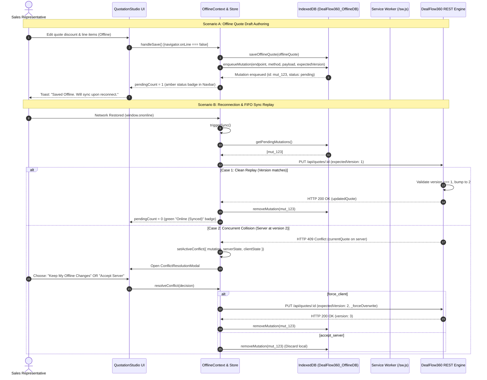

# Cognitive Code Reading Dossier: Phase 9 — Offline-First PWA & Synchronization Engine

> **Phase**: Phase 9 (Native PWA Web App Manifest, Service Worker Caching Strategies, Native IndexedDB Storage Engine, FIFO Mutation Queue Replay, and Optimistic Concurrency Control 409 Conflict Resolution)  
> **Author**: Computer 1 (Alpha Builder)  
> **Auditor**: Computer 2 (Beta Auditor)  
> **Standard**: 6-Technique Cognitive Reading Protocol ([SKILL.md](file:///.agents/skills/code-reading-dossier/SKILL.md))  
> **Compliance Target**: DealFlow360 Enterprise Autonomous CPQ & Sales Operations Platform  

---

## Technique 1: The Human Mental Model (Plain-Language Purpose & Boundary)

In real-world enterprise B2B sales operations, sales representatives, logistics leads, and buyers frequently operate in environments with unstable, intermittent, or absent network connectivity:
1. **The Field Sales Connectivity Gap**: Account executives visiting manufacturing plants, logistics depots, or client headquarters frequently encounter dead zones (basements, factory floors, rural transit) where network access drops completely. Standard web apps crash, fail silently, or lose unpersisted commercial revisions.
2. **The "Silent Overwrite" Commercial Catastrophe**: If an offline sales representative makes a price concession and their offline client blindly overwrites the server upon reconnecting, they risk erasing a managerial price floor rejection, an ongoing inventory lock, or a counter-offer submitted by the customer.
3. **Ghost Package & Runtime Fragility Risk**: Pulling in bloated third-party offline synchronization libraries (e.g. PouchDB, Dexie, Workbox) introduces dozens of transitive vulnerabilities, non-deterministic build failures, and cross-browser quirks.

**Phase 9 Implementation** solves these challenges with a lean, zero-ghost-package, enterprise offline PWA architecture:

1. **Native PWA Web App Manifest ([client/public/manifest.json](file:///client/public/manifest.json)) & Standalone Icon ([client/public/icon.svg](file:///client/public/icon.svg))**:
   - Enables native OS installation across desktop and mobile devices.
   - Configures `#714B67` theme color, `#ffffff` canvas background, and `standalone` display mode.
   - Served with `Cache-Control: no-cache, no-store, must-revalidate` in [src/index.js](file:///src/index.js) so client devices detect updates immediately.

2. **Native Service Worker Caching Engine ([client/public/sw.js](file:///client/public/sw.js))**:
   - Pre-caches the application shell (`dealflow360-shell-v1`) for instant offline launch.
   - Implements **Network-First with Cache Fallback** for read-only REST APIs (`dealflow360-api-v1`): `/api/products`, `/api/customers`, `/api/quotes`, `/api/warehouses`.
   - Implements **Stale-While-Revalidate** for static stylesheets and script assets.
   - Cleanly intercepts navigation requests to provide offline SPA fallback to `index.html`.

3. **Native IndexedDB Storage Engine ([client/src/offline/indexeddb.js](file:///client/src/offline/indexeddb.js))**:
   - Manages four isolated object stores in `DealFlow360_OfflineDB` (v1):
     - `catalog`: Cached product catalog with list prices, SKUs, and categories.
     - `customers`: Cached customer directory and assigned commercial tiers.
     - `quotes`: Local quotation drafts and active commercial proposals.
     - `mutation_queue`: Timestamp-indexed FIFO queue of offline write actions.
   - 100% native W3C IndexedDB API with zero external dependencies.

4. **Deterministic FIFO Queue Replay & Offline Context ([client/src/context/OfflineContext.jsx](file:///client/src/context/OfflineContext.jsx))**:
   - Listens to browser `online` and `offline` events.
   - When offline, intercepts quotation mutations and persists them sequentially in `mutation_queue`.
   - When online, executes sequential FIFO replay over HTTP.
   - Provides live connectivity state (`isOnline`), pending queue size (`pendingCount`), and manual `triggerSync()` controls.

5. **Optimistic Concurrency Control (OCC 409) & Conflict Modal ([client/src/components/ConflictResolutionModal.jsx](file:///client/src/components/ConflictResolutionModal.jsx))**:
   - If the server detects a version mismatch (`expectedVersion !== quote.version`) during replay, it halts replay with HTTP `409 Conflict`.
   - Displays a high-contrast side-by-side comparison modal showing the **Local Offline Draft** vs. the **Active Server State**.
   - Operator chooses either **Force Overwrite** (`resolveConflict('force_client')`) or **Accept Server State** (`resolveConflict('accept_server')`).

**Explicit Architectural Boundary**:
Phase 9 provides offline-first application launching, IndexedDB caching for catalog/customers/quotes, FIFO mutation replay, and human-governed OCC conflict resolution. Algorithmic CRDT merging is deliberately avoided: enterprise pricing, margin floor covenants, and discount thresholds require deterministic human sign-off rather than arbitrary algorithmic resolution.

---

## Technique 2: Visual Code Flow (Mermaid Call Graph)



---

## Technique 3: Variable Lifecycle Trace (Birth $\rightarrow$ Transformation $\rightarrow$ Egress)

| Variable / Symbol | Birth Location | Transformation Steps | Final Egress |
|---|---|---|---|
| `mutation` record | [client/src/offline/indexeddb.js:145](file:///client/src/offline/indexeddb.js#L145) via `enqueueMutation()` | Formats UUID `mut_<timestamp>_<rand>`, sets `timestamp`, `method`, `payload` (with `expectedVersion`), and writes to `mutation_queue` object store. | Replayed via `fetch()` in [OfflineContext.jsx](file:///client/src/context/OfflineContext.jsx#L45) upon reconnect, or purged on resolution. |
| `activeConflict` | [client/src/context/OfflineContext.jsx:55](file:///client/src/context/OfflineContext.jsx#L55) on HTTP 409 | Populated with `{ mutation, serverState, clientState }` extracted from server 409 response body. | Rendered in [ConflictResolutionModal.jsx](file:///client/src/components/ConflictResolutionModal.jsx#L8); cleared to `null` upon operator selection. |
| `isOnline` | [client/src/context/OfflineContext.jsx:13](file:///client/src/context/OfflineContext.jsx#L13) | Initialized via `navigator.onLine`; updated via window `online`/`offline` event listeners. | Controls connectivity pill in [Navbar.jsx](file:///client/src/components/Navbar.jsx#L22) and toggles offline fallback branch in [QuotationStudio.jsx](file:///client/src/pages/QuotationStudio.jsx#L295). |
| `PRECACHE_ASSETS` | [client/public/sw.js:9](file:///client/public/sw.js#L9) | Defined as array of core app shell URLs (`/`, `/index.html`, `/manifest.json`, `/icon.svg`). | Cached into `dealflow360-shell-v1` via `caches.open()` during ServiceWorker `install` event. |
| `expectedVersion` | [client/src/pages/QuotationStudio.jsx:257](file:///client/src/pages/QuotationStudio.jsx#L257) | Read from `quote.version`; passed in REST request body and parsed in [src/api/routes.js:289](file:///src/api/routes.js#L289). | Validated against `quotation.version` in [QuotationService.js:84](file:///src/services/quotation-service.js#L84); triggers `ConcurrencyConflictError` if mismatched. |

---

## Technique 4: Non-Blocking Noise Filtering (Bypassing Telemetry on Pass 1)

When auditing the Phase 9 offline synchronization flow, bypass the following auxiliary systems on First Pass to focus strictly on commercial data integrity:

| Subsystem | File & Lines | Why it is Non-Blocking Noise on Pass 1 |
|---|---|---|
| Service Worker Diagnostic Logs | [client/public/sw.js:17-40](file:///client/public/sw.js#L17-L40) | Cache cleanup and `skipWaiting` lifecycle events do not affect the commercial quotation payload math. |
| Rotating Sync Spinner CSS | [client/src/components/Navbar.jsx:84-90](file:///client/src/components/Navbar.jsx#L84-L90) | Purely cosmetic animation indicating active network request. |
| Offline Toast Notifications | [client/src/pages/QuotationStudio.jsx:315-320](file:///client/src/pages/QuotationStudio.jsx#L315-L320) | User feedback messages; actual data persistence is secured in IndexedDB before the toast fires. |
| Service Worker Cache Expiration Checks | [src/index.js:154-160](file:///src/index.js#L154-L160) | HTTP response caching headers (`no-cache, no-store`); static file delivery can be audited independently. |

---

## Technique 5: Audit Exactly One Failure Path

### Audit Focus: Optimistic Concurrency Collision (HTTP 409) During Delayed FIFO Replay

**Trigger Condition**:
1. Sales Rep A opens Quote `Q-2026-001` (Version 1) on a mobile device and boards a flight (going offline).
2. While Sales Rep A is offline, Sales Manager B reviews `Q-2026-001` on the server and applies a 5% discount reduction, bumping the quote to **Version 2**.
3. Sales Rep A lands, modifies the line item quantities offline, and saves the quote. The offline engine enqueues a mutation with `expectedVersion: 1`.
4. Sales Rep A connects to Wi-Fi. The background sync engine replays `PUT /api/quotes/Q-2026-001`.

**Execution Flow**:
1. Request arrives at [src/api/routes.js:286](file:///src/api/routes.js#L286):
   ```javascript
   const expectedVersion = req.headers["if-match"] ? parseInt(...) : body.expectedVersion;
   quotationService.updateQuotation(quoteId, body, expectedVersion);
   ```
2. In [src/services/quotation-service.js:84](file:///src/services/quotation-service.js#L84), `_assertConcurrencyVersion` executes:
   ```javascript
   const currentVersion = quotation.version || 1; // currentVersion === 2
   if (Number(expectedVersion) !== currentVersion) { // expectedVersion === 1 !== 2
     throw new ConcurrencyConflictError(...);
   }
   ```
3. `routes.js` catches `ConcurrencyConflictError`, fetches `currentQuote`, and responds with **HTTP 409 Conflict** and the server record snapshot.
4. In [client/src/context/OfflineContext.jsx:62](file:///client/src/context/OfflineContext.jsx#L62):
   ```javascript
   if (res.status === 409) {
     setActiveConflict({ mutation, serverState, clientState });
     break; // Replay halts immediately!
   }
   ```
5. Replay is cleanly halted. The pending mutation remains in IndexedDB; no data is lost or silently overwritten.
6. The operator is presented with [ConflictResolutionModal.jsx](file:///client/src/components/ConflictResolutionModal.jsx), showing exact totals and version numbers, allowing deliberate human sign-off.

---

## Technique 6: 1-Sentence Feynman Compression Test

> *"DealFlow360's offline engine turns the web browser into an autonomous, locally cached sales terminal using native IndexedDB and Service Workers, safely buffering commercial revisions offline and preventing silent data overwrites through human-governed optimistic concurrency conflict resolution upon reconnect."*
