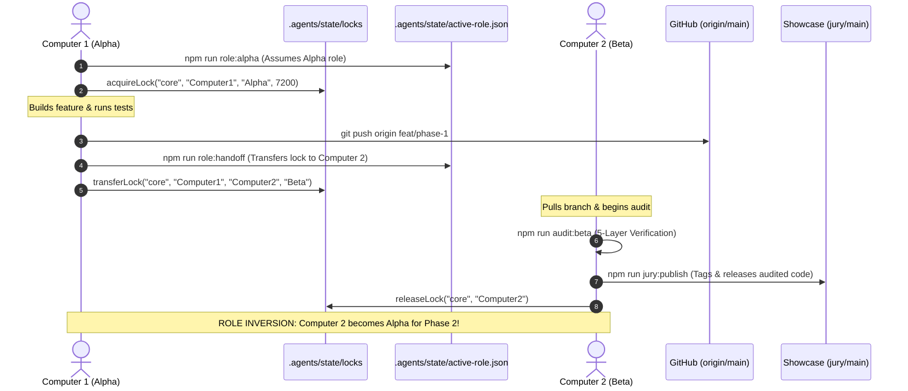

# Cognitive Comprehension Dossier: Teammate Handover & Multi-Operator Synchronization
**Domain**: `.agents/state` / `scripts/role-switch.ts` / `scripts/jury-sync.ts`  
**Phase**: Phase 1 Pre-Flight Synchronization  
**Primary Author (Alpha)**: Computer 1  
**Adversarial Auditor (Beta)**: Computer 2  

---

### Technique 1: The Human Mental Model
The multi-operator synchronization framework enables two independent workstations ("Computer 1" and "Computer 2") to act as a unified engineering pair. Instead of ad-hoc communication or manual git merges, the system guarantees distributed mutual exclusion via atomic JSON lease locks (`.agents/state/locks/<domain>.lock.json`) and an explicit state tracker (`.agents/state/active-role.json`).

When a phase begins, the active **Alpha (Builder)** holds exclusive write access to the functional domain, authors code, and produces the cognitive dossier. When development finishes, an atomic handoff transfers the domain lock to the **Beta (Auditor)** workstation, which executes the 5-layer adversarial verification battery and releases the release candidate to the `jury` showcase remote.

---

### Technique 2: Visual Code Flow

---

### Technique 3: Variable Lifecycle Trace

1. **`ActiveRoleProfile.operator`**:
   - **Birth**: Initialized from `process.env.OPERATOR_NAME` or default `"Computer1"` inside `getActiveProfile()`.
   - **Transformation**: Mutated when executing `switchToAlpha`, `switchToBeta`, or `executeRoleHandoff`.
   - **Egress**: Serialized to `.agents/state/active-role.json` with timestamp; printed in terminal during `role:status`.

2. **`ActiveRoleProfile.phase`**:
   - **Birth**: Initialized at `1`.
   - **Transformation**: Incremented exclusively upon completion of a verified Beta audit and handoff.
   - **Egress**: Used to tag release commits (`v1.0-phase-X`) during `npm run jury:publish`.

---

### Technique 4: Non-Blocking Noise Filtering
During first-pass comprehension of `scripts/role-switch.ts` and `scripts/jury-sync.ts`:
- **Ignore**: Formatting helpers, timestamp ISO string conversions, and terminal box ASCII boundaries.
- **Focus strictly on**: 
  1. `acquireLock()` mutual exclusion check (`now < expires && existing.operator !== operator`).
  2. `runBetaAudit()` exit condition (`allPassed` boolean enforcing 5/5 layers).
  3. `publishToJury()` gate condition (strictly blocking git push if any audit layer fails).

---

### Technique 5: Audit Exactly One Failure Path
**Target**: Concurrent Lease Collision during Phase Transition.
- **Attack Vector**: Computer 2 attempts to acquire `core` domain while Computer 1 holds an unexpired Alpha lease.
- **Trace**:
  1. Computer 2 executes `npm run role:alpha -- core`.
  2. `acquireLock()` reads `.agents/state/locks/core.lock.json`.
  3. Evaluates `existing.expiresAt > now` and `existing.operator !== "Computer2"`.
  4. Triggers error log: `🚨 LOCK CONFLICT: Domain 'core' is actively leased to 'Computer1' until <timestamp>`.
  5. Returns `false` and exits process with code `1`.
- **Verdict**: Mutation is blocked. Repository integrity preserved. Zero write collisions.

---

### Technique 6: 1-Sentence Feynman Compression Test
*A shared JSON lock and 5-layer audit gate guarantee that only one computer writes code while the other audits, preventing merge conflicts and releasing only mathematically verified software to judges.*
